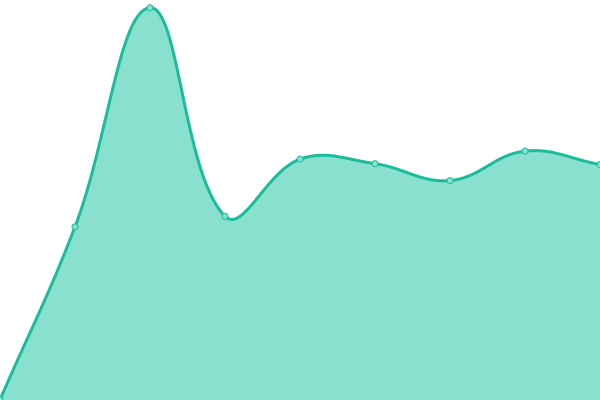
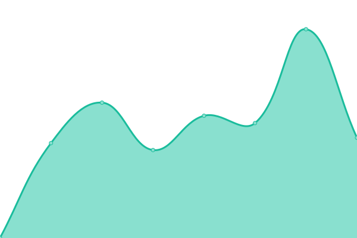

# [📈 Live Status](https://superlarsen-status.interzone.network): <!--live status--> **🟩 All systems operational**

This repository contains the open-source uptime monitor and status page for [Constructions Incongrues](https://www.constructions-incongrues.net), powered by [Upptime](https://github.com/upptime/upptime).

With [Upptime](https://upptime.js.org), you can get your own unlimited and free uptime monitor and status page, powered entirely by a GitHub repository. We use [Issues](https://github.com/constructions-incongrues/superlarsen-status/issues) as incident reports, [Actions](https://github.com/constructions-incongrues/superlarsen-status/actions) as uptime monitors, and [Pages](https://superlarsen-status.interzone.network) for the status page.

<!--start: status pages-->
<!-- This summary is generated by Upptime (https://github.com/upptime/upptime) -->
<!-- Do not edit this manually, your changes will be overwritten -->
<!-- prettier-ignore -->
| URL | Status | History | Response Time | Uptime |
| --- | ------ | ------- | ------------- | ------ |
|  [Libretime](https://libretime.superlarsen.fr) | 🟩 Up | [libretime.yml](https://github.com/constructions-incongrues/superlarsen-status/commits/HEAD/history/libretime.yml) | 

 692ms
     
 | 

<a href="https://status.superlarsen.fr/history/libretime">100.00%</a>
    

|  [Icecast](https://icecast.superlarsen.fr) | 🟩 Up | [icecast.yml](https://github.com/constructions-incongrues/superlarsen-status/commits/HEAD/history/icecast.yml) | 

 549ms
     
 | 

<a href="https://status.superlarsen.fr/history/icecast">100.00%</a>
    

|  [Castopod](https://castopod.superlarsen.fr/) | 🟩 Up | [castopod.yml](https://github.com/constructions-incongrues/superlarsen-status/commits/HEAD/history/castopod.yml) | 

 732ms
     
 | 

<a href="https://status.superlarsen.fr/history/castopod">100.00%</a>
    

|  [Wiki](https://wiki.superlarsen.fr/) | 🟩 Up | [wiki.yml](https://github.com/constructions-incongrues/superlarsen-status/commits/HEAD/history/wiki.yml) | 

 653ms
     
 | 

<a href="https://status.superlarsen.fr/history/wiki">100.00%</a>
    

|  [Wordpress](https://www.superlarsen.fr/) | 🟩 Up | [wordpress.yml](https://github.com/constructions-incongrues/superlarsen-status/commits/HEAD/history/wordpress.yml) | 

 897ms
     
 | 

<a href="https://status.superlarsen.fr/history/wordpress">100.00%</a>
    

<!--end: status pages-->

[**Visit our status website →**](https://superlarsen-status.interzone.network)

## 📄 License

- Powered by: [Upptime](https://github.com/upptime/upptime)
- Code: [MIT](./LICENSE) © [Anand Chowdhary](https://anandchowdhary.com), supported by [Pabio](https://pabio.com)
- Data in the `./history` directory: [Open Database License](https://opendatacommons.org/licenses/odbl/1-0/)
